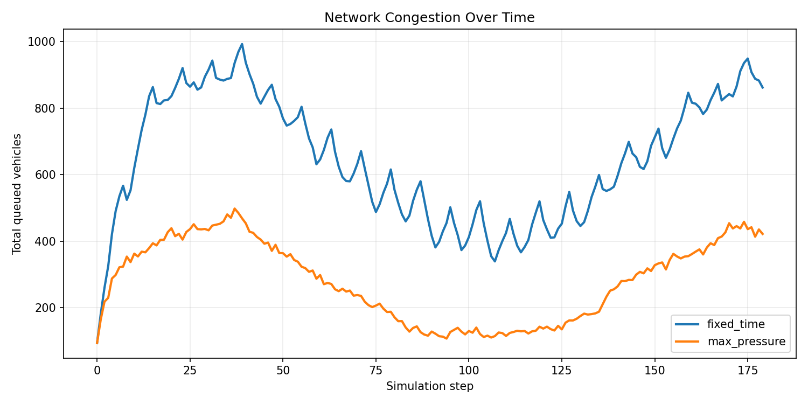
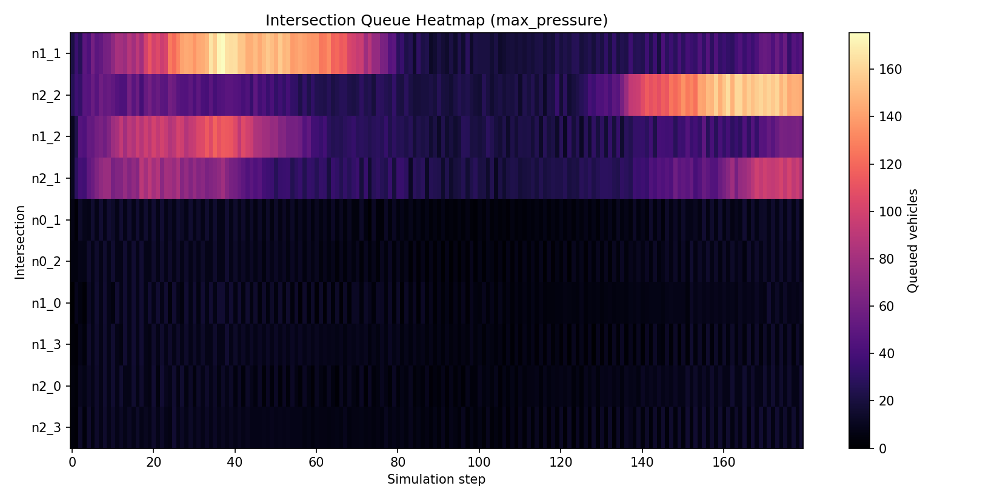
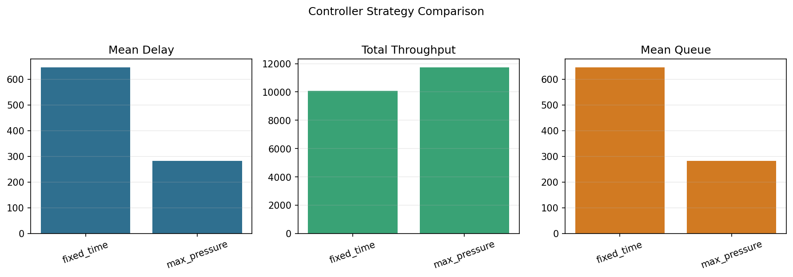

# NeuroTraffic Lab

[](pyproject.toml)
[](LICENSE)

NeuroTraffic Lab is a Python framework for intelligent transportation system
experiments. It provides a lightweight urban traffic digital twin, traffic
signal control benchmarks, reproducible metrics, and graph time-series
interfaces for future spatio-temporal forecasting models.

## Background

Traffic signal control and traffic flow prediction are core problems in
intelligent transportation systems. Realistic experiments usually require a
pipeline that connects road-network modeling, demand generation, traffic
dynamics, control decisions, and evaluation metrics. NeuroTraffic Lab provides a
compact version of that pipeline so researchers and developers can iterate on
control strategies and forecasting methods before integrating heavier
microscopic simulators.

## Features

- Queue-based macroscopic traffic simulation with link capacity, finite storage,
  turn ratios, source demand, sink exits, and downstream spillback.
- Grid-network generator for reproducible urban traffic scenarios.
- Fixed-time and max-pressure traffic signal control baselines.
- YAML-driven experiments with deterministic seeds.
- CSV outputs for network-level time series, intersection queue traces, summary
  metrics, and controller comparison tables.
- Automatic visualization for congestion trends, intersection queues, and
  strategy-level comparisons.
- Graph time-series utilities for future ST-GNN traffic forecasting models.

## Method

The simulator represents an urban road network as a directed graph. Links store
vehicle queues and enforce capacity and storage constraints. Intersections apply
control policies that select which incoming movements can discharge at each
step. Vehicles are propagated according to turn ratios and available downstream
storage. The benchmark compares:

- `fixed_time`: alternates phases with a fixed signal cycle.
- `max_pressure`: selects phases according to upstream and downstream queue
  pressure.

## Quick Start

```bash
python -m pip install -e ".[dev]"
python -m neurotraffic.cli compare --config examples/grid4x4_compare.yaml
python -m pytest
```

The main experiment writes reproducible outputs to:

```text
runs/grid4x4_compare/
  summary.csv
  comparison_table.csv
  timeseries.csv
  intersection_queues.csv
  congestion_timeseries.png
  intersection_queue_heatmap.png
  controller_comparison.png
```

## Experiment Result

Command:

```bash
python -m neurotraffic.cli compare --config examples/grid4x4_compare.yaml
```

Result table:

| controller | mean_delay | total_throughput | mean_queue | peak_queue | final_queue | delay_reduction_vs_fixed_time_pct | throughput_gain_vs_fixed_time_pct |
| --- | ---: | ---: | ---: | ---: | ---: | ---: | ---: |
| fixed_time | 646.69 | 10063.96 | 646.69 | 992.32 | 861.75 | 0.00 | 0.00 |
| max_pressure | 282.00 | 11744.20 | 282.00 | 498.02 | 421.80 | 56.39 | 16.70 |

In this benchmark, max-pressure control reduces mean delay by **56.39%** and
improves throughput by **16.70%** compared with fixed-time control.

## Visual Results

### Congestion Time Series



### Intersection Queue Heatmap



### Controller Strategy Comparison



## Documentation

- [Architecture](docs/ARCHITECTURE.md)
- [Benchmark report](docs/BENCHMARK_REPORT.md)
- [Experiment design](docs/EXPERIMENT_DESIGN.md)
- [Roadmap](docs/ROADMAP.md)
- [Chinese project overview](docs/PROJECT_BRIEF.zh-CN.md)

## Project Structure

```text
src/neurotraffic/
  cli.py                 # Experiment command line interface
  config.py              # YAML config loading and validation
  network.py             # Directed traffic graph and grid generator
  demand.py              # Reproducible traffic demand generation
  simulator.py           # Queue-based macroscopic traffic simulator
  controllers.py         # Fixed-time and max-pressure signal controllers
  metrics.py             # Metrics, comparison tables, CSV export
  visualization.py       # Experiment plots
  forecasting.py         # ST-GNN-ready graph time-series interfaces
examples/
  grid4x4_compare.yaml
  grid4x4_max_pressure.yaml
docs/
  ARCHITECTURE.md
  BENCHMARK_REPORT.md
  EXPERIMENT_DESIGN.md
  PROJECT_BRIEF.zh-CN.md
  ROADMAP.md
tests/
  test_metrics_and_forecasting.py
  test_simulator.py
runs/
  grid4x4_compare/       # Reproducible example outputs
```

## License

MIT
